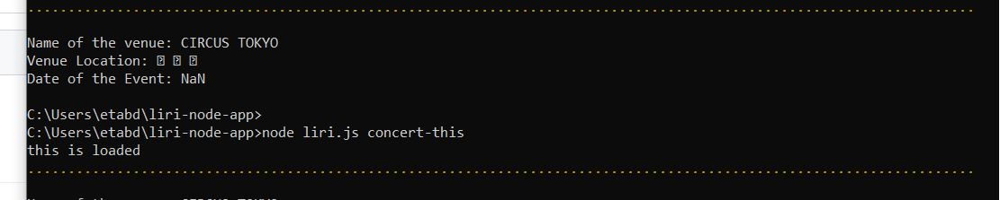

# Liri-node-app

 LIRI is command line node app that takes in parameters and gives back. Will search Spotify for songs, Bands in Town for concerts, and OMDB for movies. It take four command options;

The Commands are

     concert-this
     spotify-this-song
     movie-this
     do-what-it-says

## What Each Command Do

### node liri.js concert-this 'artist/band name here'

 This will search the Bands in Town Artist Events from 'bandsntown' API and Will render the following information
 about each event to the terminal/bash window:

     Name of the venue
     Venue location
     Date of the Event ("MM/DD/YYYY")

    
Format:  (images/concert-this.JPG)

### node liri.js spotify-this-song 'song name here'

   This will show the following information about the song in user terminal/bash window
   
      Artist(s)
      The song's name
      A preview link of the song from Spotify
      The album that the song is from
      If no song is provided then your program will default to "The Sign" by Ace of Base.

      (images\images\spotify-this-song.JPG)

### node liri.js movie-this 'movie name here'
 
 This will output the following information to user terminal/bash window:
 
       Title of the movie.
       Year the movie came out.
       IMDB Rating of the movie.
       Rotten Tomatoes Rating of the movie.
       Country where the movie was produced.
       Language of the movie.
       Plot of the movie.
       Actors in the movie.
       
   If the user doesn't type a movie in, the program will output data for the movie 'Mr. Nobody.'
        (images\images\movie-this.JPG)
  

### node liri.js do-what-it-says

        Using the fs Node package, LIRI will take the text inside of random.txt and then use it to 
        call one of LIRI's commands.
        It will run spotify-this-song for "I Want it That Way," as follows the text in random.txt.

 Each command user run result will save to log.txt file. 

   ## TECHNOLOGIES USED

       Node-Spotify-API
       Axios to grab data from the OMDB API and the Bands In Town API
       Moment
       DotEnv
       Javascript
       Nodejs
       Node packages:
       Request
       Moment
       npm check

